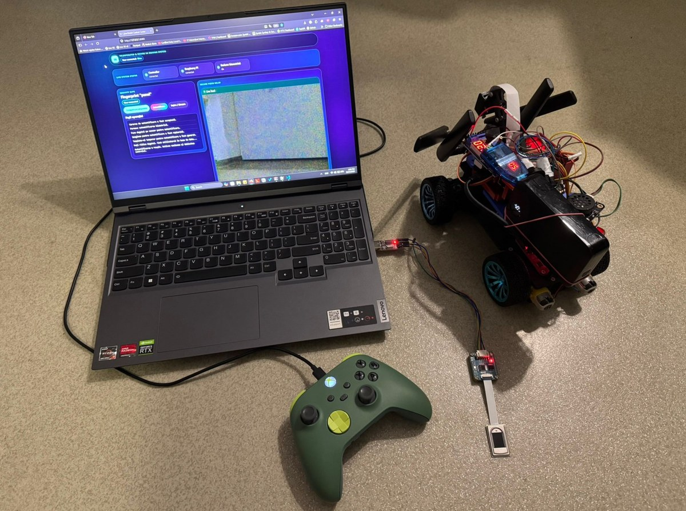
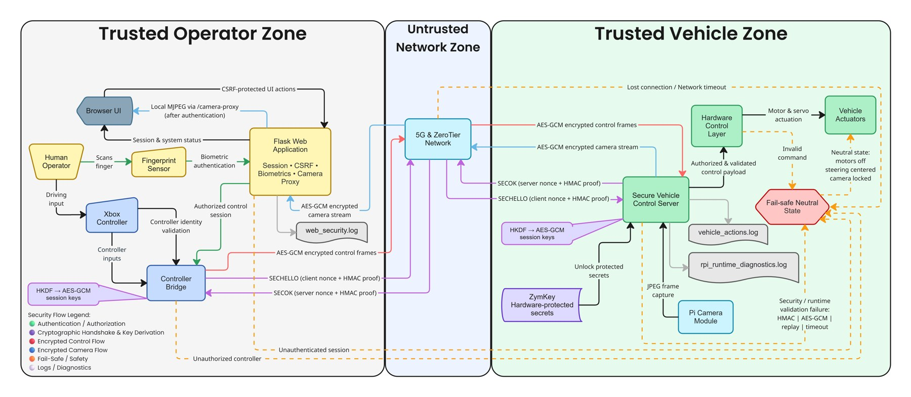
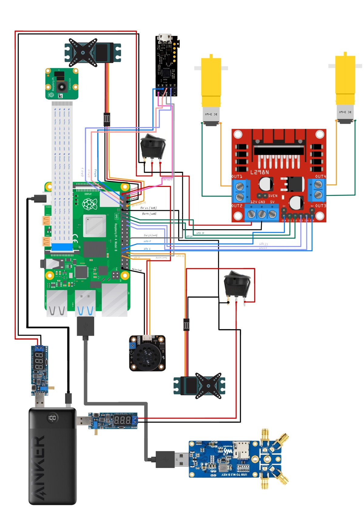
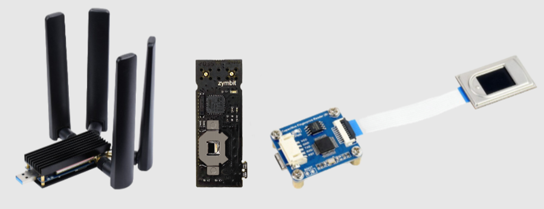

# Secure 5G Teleoperated Driving System - Public Overview

Public technical overview of a secure 5G teleoperated driving system with biometric access control, encrypted communication channels, controller validation, Raspberry Pi-side secret protection, and fail-safe vehicle behavior.

The full source code is private due to security and intellectual property considerations. This repository documents the project functionality, architecture, hardware setup, security design, and implementation approach without exposing private source code, secrets, biometric data, or internal project history.

---

## Prototype Overview

<p align="center">
  
</p>

The system allows an operator to control a Raspberry Pi-based smart vehicle from a laptop using an Xbox controller while receiving live camera feedback through a local web application.

The project extends a previous 5G teleoperated driving prototype with a security-focused architecture. The communication path is treated as untrusted, so control commands and camera frames are protected at the application layer instead of relying only on the network.

---

## Main Features

- 5G-based remote vehicle teleoperation
- Laptop-side operator station
- Xbox controller input for driving and camera movement
- Raspberry Pi vehicle controller
- Live camera feedback through a local web interface
- Biometric operator authentication using a fingerprint sensor
- Controller identity validation through fingerprint pinning
- Encrypted control channel between laptop and Raspberry Pi
- Encrypted camera stream between Raspberry Pi and laptop backend
- Raspberry Pi-side secret protection using ZymKey
- CSRF-protected web actions
- Fail-safe neutral state when authentication, communication, or validation fails
- Runtime diagnostics and operational logging

---

## System Architecture

<p align="center">
  
</p>

The architecture is divided into three main zones:

```text
Operator Station
Laptop, Flask web app, fingerprint interface, controller bridge, camera proxy

Untrusted Network Path
5G connectivity and virtual networking layer

Vehicle Platform
Raspberry Pi, camera, motors, servos, 5G modem adapter, ZymKey, and actuator control
```

The browser is intentionally kept as a low-privilege interface. It can display UI state and the local MJPEG camera stream, but it does not receive transport tokens, AES-GCM session keys, ZymKey material, or fingerprint templates.

---

## Security Design

The secure transport design is based on multiple defensive layers:

- biometric authentication before driving access;
- controller profile validation before sending active commands;
- HMAC-based mutual proof during channel setup;
- HKDF-derived session keys;
- AES-GCM authenticated encryption for protected payloads;
- fresh nonces for session freshness;
- sequence checking to reject replayed or out-of-order frames;
- separate secrets for the control channel and camera stream;
- ZymKey protection for Raspberry Pi-side transport secrets at rest;
- fail-safe behavior on invalid packets, connection loss, parsing errors, or authentication failure.

The main idea is that the 5G and virtual-network path provides reachability, but not the primary security boundary. Confidentiality, integrity, and replay resistance are enforced by the application protocol.

---

## Secure Teleoperation Flow

```text
Fingerprint authentication
        ↓
Authenticated Flask session
        ↓
Controller identity validation
        ↓
Secure control-channel handshake
        ↓
Encrypted controller commands
        ↓
Raspberry Pi validation and decryption
        ↓
Vehicle actuation
        ↓
Fail-safe neutral state if validation fails
```

For video feedback, the camera stream follows a separate protected path:

```text
Raspberry Pi camera frame
        ↓
JPEG capture
        ↓
AES-GCM encrypted camera frame
        ↓
Laptop backend camera proxy
        ↓
Decryption and MJPEG repackaging
        ↓
Browser display through local authenticated proxy
```

---

## Hardware Integration

<p align="center">
  
</p>

The vehicle platform includes:

- Raspberry Pi as the vehicle-side controller
- USB-connected M.2 5G modem adapter with SIM8200EA-M2 modem
- Raspberry Pi camera module
- Xbox controller on the operator side
- fingerprint sensor for biometric access control
- ZymKey module for hardware-backed Raspberry Pi secret protection
- DC motors for propulsion
- servo motor for steering
- servo motor for camera positioning
- L298N motor driver
- separated power paths for logic and actuator stability

Power separation and stability monitoring were added to reduce reset risks, camera instability, and unsafe actuator behavior.

---

## Security Components

<p align="center">
  
</p>

The system uses several security components together:

- **Fingerprint sensor** — authenticates the operator before vehicle control is enabled.
- **Controller pinning** — verifies that the connected Xbox controller matches the expected controller identity.
- **AES-GCM secure transport** — protects control commands and camera frames.
- **ZymKey** — protects Raspberry Pi-side secrets at rest.
- **Flask session + CSRF protection** — protects local web actions.
- **Fail-safe logic** — returns the vehicle to a neutral state when validation fails.

---

## Main Private Implementation Files

```text
app.py                 # Flask web app, sessions, fingerprint flow, CSRF, camera proxy
controller_bridge.py   # Xbox controller reader and secure command bridge
ForRaspberry.py         # Raspberry Pi-side vehicle control and secure camera stream
secure_transport.py     # HMAC, HKDF, AES-GCM, nonces, sequence validation
fingerprint_sensor.py   # Serial protocol for the fingerprint sensor
zymkey_utils.py         # ZymKey lock/unlock and hardware-random integration
```

---

## Technologies Used

- Python
- Flask
- Raspberry Pi
- Xbox controller input through pygame
- 5G connectivity
- ZeroTier-style virtual networking
- AES-GCM authenticated encryption
- HMAC-SHA256
- HKDF-SHA256
- Fingerprint sensor over serial communication
- ZymKey hardware security module
- Raspberry Pi camera
- GPIO / PWM motor and servo control
- HTML, CSS, and JavaScript for the local web interface

---

## Logging and Diagnostics

The implementation includes operational and security-oriented logging without exposing secrets or biometric templates.

Examples of logged information include:

- vehicle action summaries;
- fail-safe events;
- camera proxy status;
- biometric authentication result events;
- runtime diagnostics;
- Raspberry Pi temperature, throttling, memory, and load indicators;
- native crash traces through fault-handler logging.

Sensitive material such as channel tokens, AES keys, CSRF tokens, fingerprint templates, and raw controller payloads is not intended to be written to logs.

---

## Learning Outcomes

This project demonstrates practical experience with:

- secure cyber-physical system design;
- 5G teleoperation;
- Raspberry Pi vehicle control;
- secure transport protocols;
- biometric access control;
- hardware-backed secret protection;
- controller identity validation;
- encrypted camera streaming;
- fail-safe actuator behavior;
- secure web interface design;
- operational logging and runtime diagnostics;
- integrating software, networking, electronics, and physical vehicle control.

---

## Source Code Availability

The full source code is private due to security and intellectual property considerations.

A technical walkthrough, selected implementation details, or a sanitized explanation of the architecture can be provided upon request.

